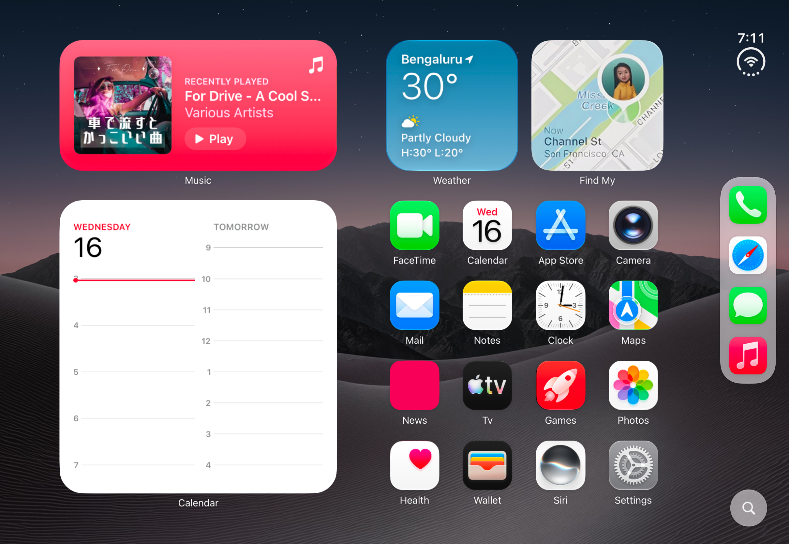

# Duo‑Blur

A SwiftUI study: an iPad home screen reimagined as the **inner display of a book‑fold device**. The screen never physically folds — the fold is faked entirely on the screen *surface* with a progressive blur that sweeps in from the edge as you tilt the iPad, so the "folding" half frosts and recedes without ever leaving an empty gap.

> Inspired by the foldable‑iPhone concept videos going around. This is a rendering & interaction study, not a real folding UI.

<!-- Swap in your own screenshot/GIF at docs/duo-home.png -->

## The effect

Tilt the iPad and the left half of the home screen appears to fold away: it darkens, frosts into a heavy progressive blur, and leans back on a subtle 3D hinge — while the right half stays flat and crisp. Let it level out and it springs back to a clean, ordinary home screen. It's driven by the gyroscope, so it reacts continuously to how you hold the device.

## How it works

- **The home screen never moves.** It's a static layout (`iPadDuoView`): widget cards, a 4×4 app‑icon grid, a Liquid Glass sidebar, and a wallpaper.
- **The "fold" is a screen‑surface effect.** `foldedCanvas` splits the screen at the centre crease. The left half gets a small 3D `rotation3DEffect`, and over it sits a **variable (progressive) blur + a dark scrim**. As the fold deepens, the frost sweeps from the outer edge toward the crease — *leading* the fold, so the receding edge reads as frosted glass rather than a void. The effect reaches the crease around ~45° and then just deepens, capped at `maxFold` (85%) so it holds at the nicest pose.
- **Motion drives it.** `MotionManager` reads the device's gravity vector via CoreMotion and exposes it as a smoothed, normalized tilt; `gyroFold()` maps the landscape roll to the fold amount. All the feel lives in a handful of named constants at the top of `iPadDuoView`: `maxBlur`, `darkStrength`, `leftFoldAngle`, `maxFold`, `gyroGain`, …

## Design notes — how it came together

The interesting parts were mostly dead ends before they were features. A few that shaped the result:

**Fake the fold on the *surface*, don't rotate the screen.** The first instinct — rotate the whole home screen as one plane, or a big physical‑looking hinge — looked wrong immediately. There's no second display to reveal, so any real rotation just exposes an empty void behind it. The move that worked: keep the home screen *flat and whole*, and sell the fold with a **blur that leads the crease**. The folding half is progressively frosted and dimmed so the eye reads "this part is angling away," and there's never a gap to explain.

**The blur is iOS's own — which means a private API.** That specific gradient frost (the one behind the status bar, nav bars and the keyboard) is Core Animation's `CAFilter("variableBlur")`. `VariableBlur` reaches it by attaching the filter to a `UIVisualEffectView`'s backdrop layer. The gotcha that cost an afternoon: **the filter reads the mask's *alpha* channel, not its luminance.** A solid grayscale ramp blurs the entire screen uniformly; what you actually need is a white image whose *alpha* fades from opaque (full blur, at the outer edge) to transparent (sharp, at the crease). It's a private API, so it's App‑Store‑rejectable — great for a concept, not for shipping.

**Reading the tilt takes some care.** Motion comes from the **gravity vector** rather than raw attitude — its components are already normalized and free of the gimbal‑lock jumps you get from Euler angles. Because the app is landscape‑locked, the roll that folds the screen is the device's **long** axis (`gy`), not the short one. The sign flips between the two landscape orientations, a small deadzone keeps a level iPad perfectly unfolded, and `gyroGain` is *signed* so flipping it mirrors which way you tilt to fold. (The Simulator has no gyroscope, so it just shows the flat screen — the fold is a real‑device thing.)

**Dialing in the feel was all iteration against reference frames.** The shallow first pass (a ~35° hinge, a light frost) didn't read as "folded." Matching the concept videos meant pushing the hinge to a near‑edge‑on **80°**, making the blur much heavier (`maxBlur` 55 → 90) and letting the frost sweep the **full** half‑width instead of stopping short — then **capping the fold at 85%** so it maxes out at the pose that looks best and simply holds there instead of collapsing to a sliver.

**The home screen is a Figma rebuild, and the icons have a pipeline.** Layout coordinates were measured off a Figma reference. App icons are exported 2× from Figma into a namespaced asset‑catalog group and each one is masked to the iOS **squircle** (a continuous rounded rectangle at ~0.2237 × side). Another gotcha: the first exports arrived as **opaque squares** — the design's dark frame colour was baked into the corners — so every tile is clipped to the squircle in code, which crops those corners cleanly. A single `maskedIcon(_:size:)` helper does that for both the grid and the sidebar dock.

**Trimming it down for sharing.** The build had an on‑screen slider and a drag‑to‑fold gesture for tuning without a device; those were pulled out so the shared code is purely gyro‑driven and uncluttered, the app was made iPad‑only, and the in‑progress iPhone variant was parked on its own branch.

### The variable blur, in brief

`VariableBlur` is a small, self‑contained `UIViewRepresentable` you can lift into your own projects (it sweeps from either edge via `fromRight`). It's the one piece here that's broadly reusable — just remember the private‑API caveat above.

## Requirements

- **Xcode 26+**, Swift 5.9+
- **iOS 26+** target — the sidebar and search button use **Liquid Glass** (`glassEffect`), with a material fallback on older systems.
- Built and tuned against **iPad Pro 11″ (M5), iOS 27** (the layout is measured for the 1194 × 834 landscape canvas).
- **A real device to feel the fold.** It's gyro‑driven; the **Simulator has no gyroscope, so it shows the flat home screen.**

## Running it

1. Open `Duo-Blur.xcodeproj`.
2. Select the **Duo-Blur** scheme and an **iPad** destination (a physical iPad to see the fold react to tilt).
3. Run, then tilt the iPad — the left half frosts and folds away.

## Project layout

| File | What it does |
|------|--------------|
| `iPad-Duo.swift` | The whole experience — `iPadDuoView` (layout + fold), `VariableBlur` (the progressive‑blur component), and small `Color(hex:)` / Liquid Glass helpers. |
| `MotionManager.swift` | CoreMotion wrapper exposing a smoothed, normalized tilt (`gx`, `gy`). |
| `MyApp.swift` | App entry point. |

## Assets & trademarks

This is a **concept / fan project and is not affiliated with, endorsed by, or sponsored by Apple Inc.** The bundled app icons, widget mockups, and wallpaper resemble Apple artwork and are included **for demonstration only**. **Apple**, **iPadOS**, the app icons, and all related names and logos are trademarks of Apple Inc. Replace the assets in `Assets.xcassets` with your own before using this beyond experimentation.

## License

The **source code** is released under the [MIT License](LICENSE). The license covers the code only — not the third‑party artwork described above.
