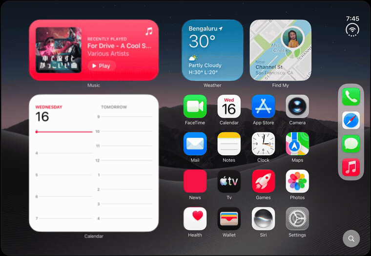

<div align="center">

# Duo‑Blur

**An iPad home screen that folds like the inside of a book.**

[](#requirements)
[](#)
[](LICENSE)



</div>

There's no folding hardware here. The screen stays flat and whole. Tilt the iPad and one half frosts over, dims, and leans away on a soft hinge, exactly the way a book‑fold display looks as it closes. Level it out and it snaps back to an ordinary home screen. All of it happens on the surface, driven by the gyroscope.

## How the fold works

Three layers sit over a static home screen:

1. A gentle `rotation3DEffect` leans the left half back from the centre crease.
2. A **progressive blur** frosts that half: heaviest at the outer edge, easing to sharp at the crease.
3. A dark scrim rides along so the folding side reads as glass catching shadow.

The trick is that the blur *leads* the tilt. As the fold deepens, the frost sweeps inward toward the crease ahead of the geometry, so the receding edge never looks like an empty gap. The feel lives in a few constants at the top of `iPadDuoView`: `maxBlur`, `leftFoldAngle`, `maxFold`, `gyroGain`.

## Notes from building it

A few things that were dead ends before they were features:

**Don't rotate the screen. Fake it on the surface.** The obvious approach, hinging the whole screen like a real page, falls apart instantly: there's no second display behind it, so any real rotation just reveals a void. Keeping the home screen flat and selling the fold with a blur that leads the crease is what made it read as "folding" instead of "tilting a picture."

**The blur is Apple's own, which means a private API.** That specific gradient frost is Core Animation's `variableBlur` `CAFilter`. The wrapper (`VariableBlur`) attaches it to a `UIVisualEffectView`'s backdrop. The catch that ate an afternoon: the filter reads the mask's **alpha**, not its brightness. A grey gradient blurs the whole screen evenly; you need a white image whose *alpha* fades from opaque to clear. It's private, so it's App‑Store‑rejectable, fine for a concept, not for shipping.

**Landscape roll is the long axis.** Motion comes from the gravity vector (stable, no gimbal‑lock jumps). Because the app is landscape‑locked, the roll that folds the screen is the device's long axis (`gy`), the sign flips between the two landscape orientations, and a small deadzone keeps a level iPad perfectly still.

**The feel is all in the numbers.** The first pass, a shy 35° hinge with a light frost, didn't sell it. Matching the reference meant pushing the hinge near edge‑on to 80°, roughly doubling the blur, sweeping the frost across the full half, and then capping the fold at 85% so it settles on the best‑looking pose instead of collapsing to a sliver.

**The icons needed clipping.** App icons export from Figma at 2× into a namespaced asset group. The first batch came back as opaque squares with the dark frame baked into the corners, so every tile gets clipped to the iOS squircle in code (`0.2237 × side`). One `maskedIcon` helper handles both the grid and the sidebar.

## Requirements

- Xcode 26+, and an **iOS 26+** target (the sidebar and search pill use Liquid Glass, with a material fallback below that).
- Built for **iPad Pro 11″ (M5), iOS 27**; the layout is measured for the 1194 × 834 landscape canvas.
- **A real iPad to feel it.** The fold is gyro‑driven, and the Simulator has no gyroscope, so it just shows the flat home screen.

## Run it

```
open Duo-Blur.xcodeproj
```

Pick the **Duo-Blur** scheme and an **iPad** destination (a physical one to see it react), run, and tilt.

## What's where

| File | Role |
|------|------|
| `iPad-Duo.swift` | The whole thing: `iPadDuoView` (layout + fold) and `VariableBlur` (the reusable progressive‑blur component). |
| `MotionManager.swift` | CoreMotion wrapper, exposes a smoothed tilt as `gx` / `gy`. |
| `MyApp.swift` | App entry point. |

## Assets

Concept / fan project, **not affiliated with or endorsed by Apple**. The bundled icons, widgets, and wallpaper resemble Apple artwork and are here for demonstration only; Apple and the app marks belong to Apple Inc. Swap in your own art in `Assets.xcassets` before doing anything beyond experimenting.

## License

Code is [MIT](LICENSE). The license covers the source, not the third‑party artwork above.
